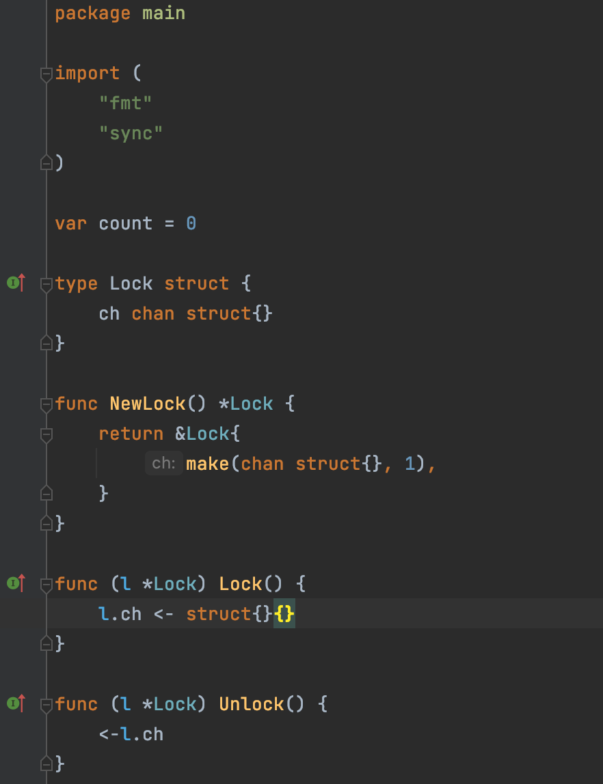
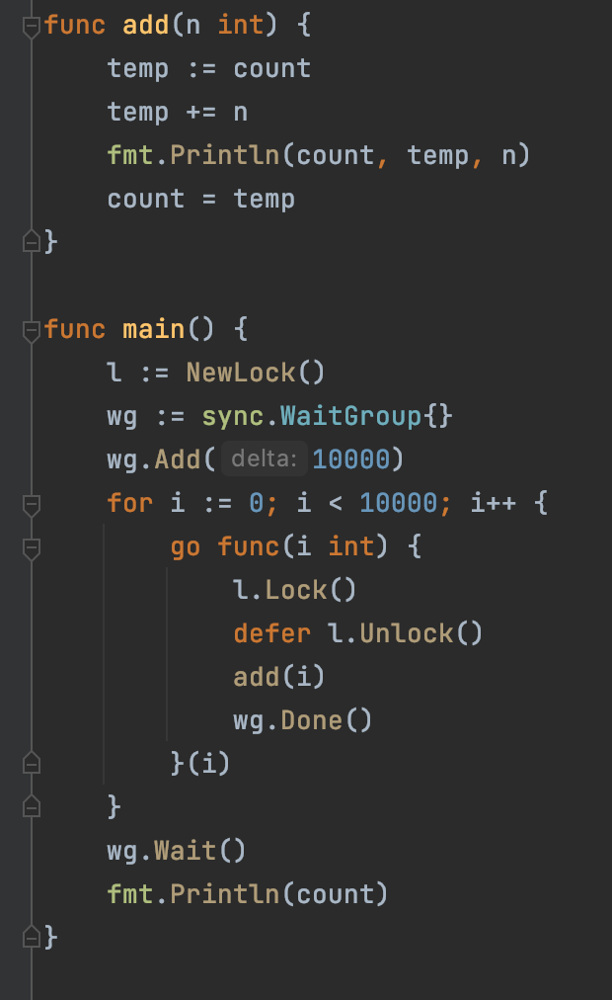

## 无缓冲chan如何定义？
- `make(chan int)` 或 `make(chan int, 0)`
- 在接收前没有能力保存任何值的通道
- 两个通道发送和接收行为是同步的，必须同时准备好才能继续执行

## Go的并发模型是怎么样的？
- 两种：CSP并发模型 和 线程-锁(依赖共享内存实现)并发模型
- CSP
  - 并发实体（线程，互相独立且可以并发执行）
  - 通道（并发实体直接通过通道发送消息）
- 并发实体在读取一个永远没有数据放入的通道或者把数据放入一个永远不会被读取的通道，会被阻塞，发生死锁
- 补充：线程模型——GPM线程模型

## defer是什么时候执行的？
- 在return操作 给返回值赋值操作后
- 在return操作 执行 RET指令之前
- defer执行顺序 倒序执行

## 如何判断map内是否包含某个值？
- `v, ok := map[k]`

## 用chan实现一个互斥锁？

